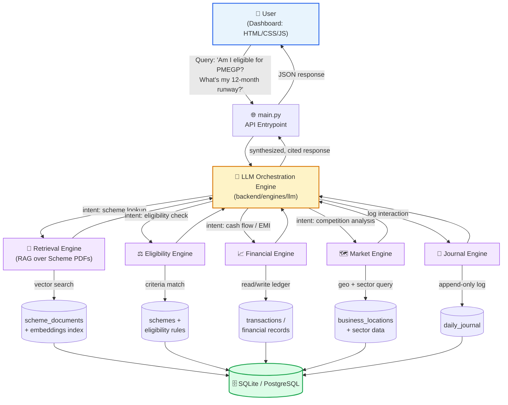

# 💰 ArthX — AI-Powered Financial Co-Pilot for Indian MSMEs

<div align="center">

**Smart India Hackathon 2026 | Problem Statement ID: SIH26091**

**Domain:** Financial Advisory · Government Scheme Recommendation · Business Simulation for MSMEs

[](https://www.python.org/)
[](https://www.sqlite.org/)
[](https://www.postgresql.org/)
[](https://pytest.org/)
[](#)

</div>

---

## 📌 Executive Summary

India is home to over **63 million MSMEs**, contributing nearly **30% of the national GDP** and employing more than **110 million people**. Yet the majority of these businesses — tea stalls, tailoring units, small manufacturers, and local service providers — operate with **no formal financial planning, no visibility into applicable government subsidies, and no understanding of local market saturation**.

The Indian government runs hundreds of MSME-focused schemes (PMEGP, CGTMSE, Mudra Yojana, Stand-Up India, and dozens of state-level subsidies), but scheme discovery is fragmented across PDFs, government portals, and word-of-mouth. Eligibility criteria are dense legal text. Most business owners either miss out entirely or discover schemes too late.

**ArthX bridges this gap** by combining:

- 🧠 **Retrieval-Augmented Generation (RAG)** over official government scheme documents, so answers are grounded in real policy text — not hallucinated.
- ⚖️ **Rule-based eligibility evaluation** engineered from actual scheme criteria (revenue slabs, sector codes, location, business vintage).
- 📈 **Financial simulation** so an owner can see cash flow, runway, and EMI feasibility *before* committing to a loan or subsidy application.
- 🗺️ **Market intelligence** that quantifies competitor density in a given locality and sector — turning "should I open here?" into a data-backed decision.
- 🤖 **An agentic LLM orchestration layer** that ties all of the above together into a single conversational interface.

In short: **ArthX turns a small business owner's raw financial situation into a personalized, explainable, and actionable roadmap** — connecting policy, capital, and market reality in one dashboard.

---

## 🏗️ System Architecture

ArthX follows a **modular engine-based architecture**. A user query enters through the dashboard, gets interpreted and routed by the LLM orchestration layer, is answered by one or more specialized engines, and is grounded against the persistent database and document corpus.



---

## ⚙️ The Six Engines

ArthX's backend is composed of six purpose-built engines, each independently testable and orchestrated by the LLM layer.

### 1️⃣ Retrieval Engine (`backend/engines/retrieval`)
Implements a **RAG pipeline** over official government scheme PDF documents (scheme guidelines, notifications, circulars). Documents are chunked, embedded, and indexed so that when a user asks a natural-language question, the engine retrieves the most relevant passages and grounds the LLM's answer in actual policy text — eliminating hallucinated eligibility claims.

**Key responsibilities:** PDF ingestion & chunking, embedding generation, semantic vector search, source citation for every retrieved answer.

### 2️⃣ Eligibility Engine (`backend/engines/eligibility`)
Translates dense scheme criteria into structured, machine-evaluable rules. Given a user's **revenue, sector, and location**, it cross-references `backend/db/seed_eligibility.py` rule sets to return a ranked list of schemes the user actually qualifies for, along with the specific criteria met or missed.

**Key responsibilities:** Rule-based qualification checks, gap analysis ("you need 6 more months of vintage"), scheme ranking by relevance.

### 3️⃣ Financial Engine (`backend/engines/financial`)
A simulation engine that models the business's financial future. It calculates **cash flow projections, runway (months of survival at current burn), and EMI feasibility** for any loan or subsidy the user is considering — answering "can I actually afford this?" before the user commits.

**Key responsibilities:** Cash flow forecasting, runway calculation, loan/EMI affordability modeling, scenario simulation ("what if revenue drops 20%?").

### 4️⃣ Market Engine (`backend/engines/market`)
Performs **competitor density analysis** using location and sector data seeded via `seed_locations.py`. It answers strategic questions like "how saturated is the tailoring market in my pin code?" — helping owners make informed decisions about expansion, pricing, or diversification.

**Key responsibilities:** Geo-sector competitor mapping, saturation scoring, opportunity-gap identification by locality.

### 5️⃣ Journal Engine (`backend/engines/journal`)
Maintains a **daily business transaction and query ledger** — an append-only record of financial activity and user interactions. This powers historical trend analysis, feeds the Financial Engine with real transaction data, and creates an audit trail for every recommendation ArthX has made.

**Key responsibilities:** Transaction logging, query history, data feed for downstream financial modeling, auditability.

### 6️⃣ LLM Orchestration Engine (`backend/engines/llm`)
The **agentic brain** of ArthX. It interprets natural-language user queries, determines intent, routes the request to one or more of the five engines above (often in combination — e.g., "Should I take a Mudra loan?" touches Eligibility, Financial, *and* Retrieval), and synthesizes a single coherent, cited response.

**Key responsibilities:** Intent classification, multi-engine tool orchestration, context management across conversation turns, response synthesis with source grounding.

---

## 🗄️ Database Layer (`backend/db/`)

| Seeder | Purpose |
|---|---|
| `seed_schemes.py` | Populates the master list of government MSME schemes (PMEGP, CGTMSE, Mudra, state schemes, etc.) |
| `seed_locations.py` | Seeds location and sector data used for market density analysis |
| `seed_scheme_documents.py` | Ingests and indexes source PDF documents for the RAG pipeline |
| `seed_eligibility.py` | Loads structured eligibility rule sets mapped to each scheme |

Supports both **SQLite** (rapid local development) and **PostgreSQL** (production-grade deployment) via a shared schema layer.

---

## 🚀 Local Setup Guide

### Prerequisites

- Python **3.10+**
- `pip` and `venv`
- SQLite (bundled with Python) or a running PostgreSQL instance for production mode

### Step 1 — Clone the Repository

```bash
git clone https://github.com/<your-org>/SIH26091---Team-ArthX.git
cd SIH26091---Team-ArthX
```

> ⚠️ **Stay in the project root** (`SIH26091---Team-ArthX/`) for every command below. The `backend/` folder is a Python package, not a directory to `cd` into — running module commands from inside it will break imports.

### Step 2 — Create and Activate a Virtual Environment

```bash
python -m venv venv

# On Linux/macOS
source venv/bin/activate

# On Windows
venv\Scripts\activate
```

### Step 3 — Install Dependencies

```bash
pip install -r requirements.txt
```

### Step 4 — Configure Environment Variables

Create a `.env` file in the project root:

```env
DATABASE_URL=sqlite:///backend/db/arthx.db
# For PostgreSQL instead:
# DATABASE_URL=postgresql://<user>:<password>@localhost:5432/arthx

LLM_API_KEY=<your-llm-provider-api-key>
EMBEDDING_MODEL=<your-embedding-model-name>
```

### Step 5 — Initialize and Seed the Database

Run the seeders in order — later seeders depend on data created by earlier ones.

**From the project root** (recommended — matches the `.env` and `main.py` paths above):

```bash
python -m backend.db.seed_schemes
python -m backend.db.seed_locations
python -m backend.db.seed_scheme_documents
python -m backend.db.seed_eligibility
```

**If you are instead inside the `backend/` folder**, drop the `backend.` prefix — otherwise Python will raise `ModuleNotFoundError: No module named 'backend'`:

```bash
python -m db.seed_schemes
python -m db.seed_locations
python -m db.seed_scheme_documents
python -m db.seed_eligibility
```

### Step 6 — Run the Test Suite

```bash
pytest
```

### Step 7 — Launch the Application

```bash
python main.py
```

### Step 8 — Open the Dashboard

- **If `main.py` serves the frontend as static files** (e.g., via FastAPI/Flask `StaticFiles` or a similar mount), open:

  ```
  http://localhost:8000
  ```

  (Adjust the port to match your `main.py` server configuration.)

- **If the frontend is plain static HTML/CSS/JS not served by the backend**, open `frontend/index.html` directly in your browser, or serve it separately with a tool like VS Code's Live Server so relative asset paths resolve correctly. In this case, ensure the frontend's API calls point to wherever `main.py` is running (e.g., `http://localhost:8000/api/...`).

---

## 🧪 Example Interaction

```
User Query:
"I run a small textile unit in Surat with ₹8 lakh annual revenue.
 Am I eligible for any government schemes, and can I afford a ₹5L loan?"

ArthX Response Flow:
  1. LLM Orchestrator → classifies intent: [eligibility + financial]
  2. Eligibility Engine → matches against PMEGP, CGTMSE criteria
  3. Retrieval Engine  → pulls relevant clauses from scheme PDFs
  4. Financial Engine  → simulates EMI feasibility against current cash flow
  5. LLM synthesizes   → single grounded, cited recommendation
```

---

## 🗺️ Future Roadmap

- 🗣️ **Multilingual Voice Interface** — Voice-to-text input in regional Indian languages (Hindi, Bengali, Tamil) to eliminate the digital literacy barrier for grassroots MSME owners.
- 💬 **WhatsApp Conversational Bot** — A lightweight query interface over the WhatsApp Business API for low-bandwidth, no-app-install access in rural areas.
- 📸 **Automated Document OCR** — Instant extraction of turnover and sector data from Udyam registration and GST certificates to auto-fill eligibility checks.

---

## 👥 Team ArthX

Built with ❤️ for **Smart India Hackathon 2026** — Problem Statement **SIH26091**.

> *"Democratizing financial literacy and government scheme access for every small business in India — one query at a time."*

---

<div align="center">

**⭐ If you find ArthX impactful, consider starring the repository ⭐**

</div>
